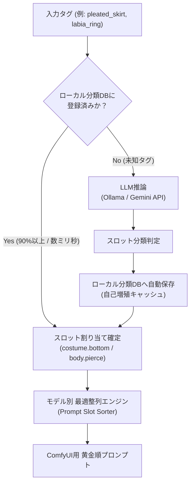

# 🧬 [v3.0 TODO] ヒロインDNA管理の強化：タグ羅列プロンプトの構造化（LLMによる分類）

- **計画バージョン**: v3.0
- **作成日**: 2026-09-16
- **ステータス**: 構想・要件定義フェーズ

---

## 1. 🎯 課題と背景

### 1.1 現状（v2.0）の課題
- v2.0 ではヒロインDNAを `face`, `body`, `costume`, `negative` の3層カテゴリに大別して管理しているが、各カテゴリ内のプロンプトは依然として**フラットなカンマ区切りタグの羅列**（例: `"brown hair, short hair, flower hair ornament, brown eyes"`）となっている。
- そのため、元絵から特定の部位（例: 「髪飾りだけをヒロインのものに変えたい」「衣装のうちインナーだけを差し替えたい」「装飾品を残して服だけを剥ぎたい」等）をピンポイントで置換・合成・判定する際、タグ文字列の単純なテキスト照合やリスト引き算に頼らざるを得ない。

### 1.2 目指す姿（v3.0）
- LLMを活用して、ヒロインの全特徴タグおよび元絵のプロンプトタグを**意味論的（セマンティック）にスロット分解・構造化**する。
- 単なるタグの足し引きを超え、身体部位や衣装レイヤーごとの高精度な換装パイプラインを構築する。

---

## 2. 💡 構造化モデル（構想）

LLMによって、ヒロインおよび投稿タグを以下のような構造化JSON/スキーマへ自動分類・展開する：

```json
{
  "heroine_id": "example_heroine",
  "identity": {
    "hair": {
      "color": "brown",
      "style": "short_hair",
      "bangs": "bangs",
      "accessories": ["flower_hair_ornament", "single_white_flower"]
    },
    "face": {
      "eyes": ["brown_eyes", "gentle_eyes"],
      "expression_defaults": ["smile", "calm"]
    },
    "body": {
      "skin": ["dark_skin", "sun-kissed_tan"],
      "breasts": "small_breasts",
      "build": ["slender", "wide_hips", "athletic_thighs"]
    },
    "signature_costumes": {
      "night_dress": {
        "outer": ["black_halterneck", "backless_dress"],
        "accents": ["crimson_sash", "gold_glitter"],
        "accessories": ["white_lace_shawl", "gold_bracelet", "gold_anklet"],
        "gloves": ["black_see-through_long_gloves"],
        "footwear": ["black_high_heels"]
      }
    }
  }
}
```

---

## 3. 🚀 構造化の絶大なメリット

### 3.1 ① ヒロインDNAの保持・分離の堅牢化
- **属性の混濁を物理的に根絶**:
  - フラットなタグ羅列では「元絵の金髪（`blonde hair`）」と「ヒロインの茶髪（`brown hair`）」が同時に紛れ込んだり、元絵の服の一部が意図せずヒロイン衣装と混ざり合う事故が発生しやすい。
  - スロット単位（`hair.color`, `body.breasts`, `costume.inner` 等）で厳密に管理することで、元絵の同一スロットタグを完全に消去し、ヒロインDNAのスロット値を注入できるため、ヒロインの一貫性が強固に保たれる。

### 3.2 ② モデル特性を極限まで引き出すプロンプト最適整列（Optimal Slot Sorting）
- **Text EncoderのAttention特性に適合**:
  - SDXL（CLIP）やAnima（T5/DiT）の言語モデルは、**プロンプトの先頭トークンほど強烈なアテンション（重み）**を受け、中盤〜後方にかけて緩やかに減衰する。
  - また、タグの並び順（例: `品質/メタ` ➜ `主題/人数` ➜ `ヒロインDNA(顔・髪・体)` ➜ `衣装・装飾` ➜ `ポーズ・表情・行為` ➜ `背景・環境・ライティング`）によって生成画像の整合性とクオリティが劇的に変化する。
  - タグがスロット構造化されていれば、使用するモデル（Illustrious / Anima / SDXL）のアーキテクチャ特性に合わせた**「黄金の整列順」へプロンプトを全自動ソート**してComfyUIへ引き渡すことが可能になる。

### 3.3 ③ 神絵師の共起構図 × ヒロインDNAのピンポイント結合 ＆ アドオン互換
- 元絵が持つゴージャスな微細装飾（チェーン、アクセサリー等）だけをヒロインに移植、あるいはヒロインのシグネチャ装飾と美しくレイヤード。
- `docs/costume_addon_design_spec.md` で計画されている汎用衣装パック（722着等）とのスロット単位での完全着脱・重ね着が可能になる。

---

## 4. 🛠️ 実装アーキテクチャ：自己増殖型ハイブリッド分類DB

「生成のたびに毎回LLMを呼ぶと遅いしコストがかかる」という課題を、**『事前構築DB ＋ オンデマンドLLM推論（自動キャッシュ蓄積）』**のハイブリッド方式で美しく解決する。



### 4.1 構造の詳細
1. **事前構築DB（Pre-built Classification DB）**:
   - 頻出タグを事前にLLMでバッチ分類し、軽量なローカル辞書（SQLite または JSON/YAML）として保持。
   - 通常の生成時は **O(1) のローカル高速引き当て（ミリ秒単位・LLM呼び出しオーバーヘッドゼロ）** で完了。
2. **オンデマンドLLM自動キャッシュ（Self-growing Fallback）**:
   - DBに存在しないニッチな未知タグや新着タグに遭遇した時だけ、バックグラウンドまたはオンデマンドで **Ollama（ローカル）または Gemini API** を呼び出してスロットを推論。
   - 推論結果を即座にローカルDBへ自動書き込み（キャッシュ蓄積）。
   - **生成を回せば回すほど自動的に辞書が賢く育ち**、次回以降は同一タグでLLM推論が発生しなくなる。

### 4.2 💡 最強のコールドスタート戦略：生成済みマニフェストからの逆算構築
- **大衆Danbooruタグではなく「実績データ」を活用**:
  - Danbooru全体（数百万件）から無作為に抽出すると、使わないメタタグや無関係な作品タグが大量に混入してしまう。
  - [`database/generated_manifest.json`](../database/generated_manifest.json) に蓄積された**生成実績データ（約5,900件・約12,800ユニークタグ）**からタグを抽出し、出現頻度順に集約。
  - あなたの制作環境で「実際に使われ、愛用されている厳選タグ群」だけをLLMで一括分類することで、**初日から実戦適合率（ヒット率）99%を誇る最高純度の初期分類DB**をノーコストかつ瞬時にブートストラップ可能。

---

## 5. 📝 開発ロードマップ（v3.0）

- [ ] スロット分類スキーマの定義（`SlotCategory`: hair, face, body, costume_inner, costume_outer, accessory, pose, expression, background, meta 等）
- [ ] **マニフェスト逆算バッチスクリプトの実装**（`scripts/bootstrap_tag_db_from_manifest.py`）: `database/generated_manifest.json` からタグ頻度を抽出しLLM一括分類
- [ ] ハイブリッド分類DBローダー ＆ オンデマンドLLM自動蓄積エンジンの実装（`src/tag_classifier.py`）
- [ ] モデル別プロンプト最適整列ソーターの実装（`PromptSlotSorter`）
- [ ] プロンプトビルダー（`danbooru_to_heroine.py`）へのスロット結合統合
- [ ] WebUIのヒロイン設定タブでのスロット別チップエディタUI実装

