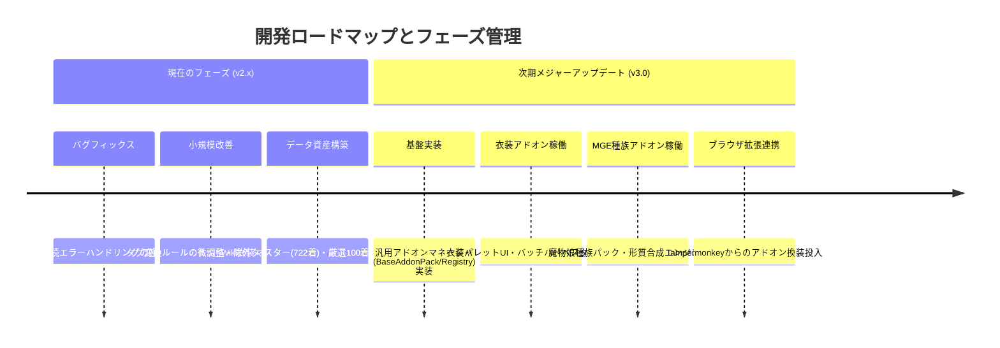

# 🧩 danbooru-to-your-heroine: 汎用アドオン・フレームワーク（Generic Addon Framework）設計仕様書
> **サブタイトル**: Costume / MGE Species / Custom Database 統合拡張アーキテクチャ

**文書バージョン**: 2.0.0  
**作成日**: 2026-09-05  
**計画対象**: 次期メジャーアップデート（v3.0）  
**現在のステータス**: 構想・仕様策定フェーズ（**コード実装は一切保留**）

---

> [!IMPORTANT]
> ### 🚨 開発フェーズと実装方針に関する絶対原則
> 1. **現在はバグフィックスおよび細部改善フェーズ（v2.x）です**。
>    - システムの安定稼働、既存バッチ処理の信頼性向上、タグ変換精度の調整、UI/UXの微修正を最優先とします。
> 2. **本仕様書に記載されたアドオン機能のコード実装は現フェーズでは一切行いません**。
> 3. **実装は次のメジャーアップデート（v3.0）にて一括して執り行う予定**です。
>    - 本文書は、次期開発時に手戻りなく統一的なアーキテクチャで実装を開始するための設計・合意形成ドキュメントです。

---

## 1. 🌟 概要と設計思想 (Overview & Philosophy)

### 1.1 背景と課題
従来の `danbooru-to-your-heroine` は、Danbooruの元絵タグを解析してヒロインDNAに換装する「元絵維持（`source`）」か、ヒロイン定義に固定された少数の衣装タグを適用する「固定衣装（`heroine`）」の二者択一でした。
さらに、衣装（Costume）の拡張だけでなく、**MGE種族（魔物娘図鑑 / Monster Girl Encyclopedia）の身体特性・形態変異**や、シチュエーション・背景といった多様な概念をヒロインと掛け合わせるニーズが存在します。

これらを個別の ad-hoc な仕組みで実装すると、コードの肥大化やメンテナンス性の崩壊を招きます。そのため、衣装だけでなく**あらゆる外部概念データベースを統一的に扱える「汎用アドオン・フレームワーク（Generic Addon Framework）」**を設計します。

### 1.2 コアバリュー
1. **共通プラグイン・アーキテクチャ**:
   「衣装（Costumes）」「MGE種族（MGE Species）」「シチュエーション（Scenarios）」などの異なる概念を、同一の抽象インターフェース（`BaseAddonEntry` / `AddonPack`）で透過的に管理します。
2. **Danbooru神構図 × 11レイヤーDNA合成の汎用化**:
   Danbooru上の数百万件のイラストから各アドオンのコア概念に適した「神絵師の構図・共起装飾・ライティング」を自動取得し、ヒロインDNA（L2）とアドオン特性（L3）を衝突なく美しく再受肉させます。
3. **ホットリロード＆パック（Pack）形式**:
   `database/addons/<addon_type>/*.json` にJSONファイルを投入するだけで、本体サーバーの再起動なしに即座にパレットやAPIへ反映されます。
4. **レーティング交互生成（SFW / NSFW）の共通化**:
   健全版（non-explicit）と成人向け版（explicit）の探索・生成パイプラインをアドオン種別を問わず共通実行できます。

---

## 2. 📂 ディレクトリ＆アーキテクチャ構造

ツールの既存コア（v2.x）を汚染せず、次期v3.0において完全に疎結合なプラグイン構造として配置します。

```text
danbooru_yukikaze_tool/
├── database/
│   └── addons/                                # [次期v3.0] 汎用アドオンデータルート
│       ├── costumes/                          # 衣装アドオンパック
│       │   ├── wiki_costumes_master.json      # 公式Wiki全網羅マスター（722着）
│       │   ├── wiki_costumes_100_curated.json # 厳選100着パック（SF除外・交互実証済）
│       │   └── taimanin_300_costumes.json     # 300衣装プロジェクト資産
│       ├── mge_species/                       # [共通設計] MGE種族アドオンパック
│       │   ├── mge_species_master.json        # 魔物娘種族マスター（身体形質・固有属性）
│       │   └── mge_popular_50.json            # 人気種族セレクション
│       └── scenarios/                         # [共通設計] シチュエーション・背景パック
├── docs/
│   └── costume_addon_design_spec.md           # 本仕様書（汎用アドオン仕様）
├── src/
│   ├── addons/                                # [次期v3.0] アドオン共通基盤
│   │   ├── __init__.py
│   │   ├── base.py                            # 抽象基底クラス（BaseAddonPack, BaseAddonEntry）
│   │   ├── registry.py                        # アドオン登録・探索・ホットリロード管理
│   │   ├── costume_provider.py                # 衣装特化プロバイダ
│   │   └── mge_provider.py                    # MGE種族特化プロバイダ（形質合成・タグ競合制御）
│   ├── server.py                              # /addons/* 共通APIマウント
│   └── web/                                   # UI共通パレットモーダル
│       ├── index.html                         # 汎用パレットセレクター
│       ├── style.css                          # アドオンカード用UIスタイル
│       └── app.js                             # アドオンAPIクライアント
```

---

## 3. 🧬 共通データモデル定義 (Generic Data Models)

すべての概念（衣装、MGE種族、その他）は、共通スキーマを基底として継承・定義されます。

### 3.1 共通アドオンパック (`AddonPackMetadata`)
```json
{
  "pack_id": "mge_popular_50",
  "addon_type": "mge_species",
  "name": "MGE 人気魔物娘50種族パック",
  "description": "魔物娘図鑑の主要50種族の身体形質・固有装飾・シチュエーション定義。",
  "version": "1.0.0",
  "author": "MGE Synthesizer",
  "categories": ["mammal", "reptile_amphibian", "aquatic", "avian", "undead", "demon"],
  "total_count": 50
}
```

### 3.2 共通エントリモデル (`BaseAddonEntry`)
各エントリは以下の共通フィールドを持ち、Danbooruクエリ・健全タグ・Hタグ・競合除外ルールをカプセル化します。

```typescript
interface BaseAddonEntry {
  id: string;                      // 一意な識別子 (例: "costume_wiki_0038", "mge_alraune")
  addon_type: string;              // "costume" | "mge_species" | "scenario"
  category: string;                // カテゴリ分類
  name_ja: string;                 // 日本語表示名
  name_en: string;                 // 英語表示名
  danbooru_count: number;          // Danbooruでのタグ投稿数
  booru_query: string;             // Danbooru探索用基本クエリ (例: "armor -simple_background")
  tags: string[];                  // 健全プロンプト用コアタグ群
  h_tags: string[];                // Hシーン・過激表現用追加タグ群
  negative_tags?: string[];        // 競合防止用除外タグ群
  co_occurrence_anchors?: string[];// 構図・背景の共起を誘発するアンカー
  thumbnail_post_id?: number;      // 代表サムネイル画像ID
  metadata?: Record<string, any>;  // 種族固有・衣装固有の自由属性
}
```

#### エントリ実例 1: 衣装（Costume）
```json
{
  "id": "wiki_0038",
  "addon_type": "costume",
  "category": "fantasy_rpg",
  "name_ja": "鎧",
  "name_en": "Armor",
  "danbooru_count": 148539,
  "booru_query": "armor -simple_background",
  "tags": ["armor", "breastplate", "pauldrons", "greaves"],
  "h_tags": ["damaged_armor", "exposed_breasts", "torn_undershirt"],
  "negative_tags": ["bikini_armor"],
  "thumbnail_post_id": 9457045
}
```

#### エントリ実例 2: MGE種族（MGE Species）
```json
{
  "id": "mge_0012",
  "addon_type": "mge_species",
  "category": "plant",
  "name_ja": "アルラウネ",
  "name_en": "Alraune",
  "danbooru_count": 3210,
  "booru_query": "alraune -simple_background",
  "tags": ["huge_flower", "plant_lower_body", "petals", "vines", "leaf_hair"],
  "h_tags": ["aphrodisiac_nectar", "tentacles", "bondage"],
  "negative_tags": ["human_legs"],
  "metadata": {
    "mge_number": 12,
    "habitat": "tropical_rainforest",
    "temperament": "seductive"
  },
  "thumbnail_post_id": 8124901
}
```

---

## 4. 🔌 統合 API エンドポイント設計 (Unified API)

次期v3.0では、アドオンの種類（`type`）をパスパラメータに取る統一REST APIを提供します。

| メソッド | パス | 説明 |
| :--- | :--- | :--- |
| **GET** | `/api/addons/types` | 利用可能なアドオンタイプ一覧取得 (`costumes`, `mge_species` 等) |
| **GET** | `/api/addons/{type}/packs` | 指定タイプのアドオンパック一覧を取得 |
| **GET** | `/api/addons/{type}/packs/{pack_id}` | パック内のエントリ一覧（検索・カテゴリフィルタ対応） |
| **GET** | `/api/addons/{type}/entry/{id}` | 特定エントリの詳細情報・推奨プロンプトを取得 |
| **POST** | `/api/addons/{type}/harvest` | 単一エントリのDanbooru構図を探索してキュー投入 |
| **POST** | `/api/addons/{type}/batch/start` | パック単位での全自動連続生成を開始（モード指定可） |

---

## 5. 🖥️ WebUI / フロントエンド設計 (Unified Palette)

- **汎用パレットモーダル（Addon Palette Modal）**:
  生成タブに新設される `[🧩 アドオンパレット]` ボタンから単一の洗練されたモーダルを展開。
  - 最上部に「タイプ切り替えタブ（👗 衣装 / 🐾 魔物娘種族 / 🌆 シチュエーション）」。
  - 選択されたタイプに応じた「パックセレクター」「カテゴリチップ」「検索バー」。
  - カードクリックで、プロンプトの特定レイヤー（衣装層、種族形質層）へ安全にインジェクション。
- **ギャラリー連携**:
  - 生成画像に `[👗 鎧]`、`[🐾 アルラウネ]` などのメタバッジを付与。
  - フィルタ機能で「アルラウネ × ゆきかぜ」などのクロス検索を即座に実現。

---

## 6. 🗓️ 開発ロードマップと現行フェーズの位置づけ



| バージョン | フェーズ | 方針とスコープ | 実装状況 |
| :--- | :--- | :--- | :--- |
| **v2.x** | **バグフィックス＆小改善（現在）** | ・システムの安定性担保、接続切断時の自動復旧<br>・プロンプト変換ルールの微調整<br>・データ調査・仕様策定のみ行い、**アドオン本体の実装は行わない** | **進行中（最優先）** |
| **v3.0** | **次期メジャーアップデート** | ・汎用アドオン・フレームワークの設計に基づく完全実装<br>・衣装およびMGE種族パックの正式プラグイン化<br>・WebUIパレットおよび自動ハーベスターの統合 | **次回大型開発で実施** |

---

> [!NOTE]
> 本設計書は将来の拡張に向けたアーキテクチャの定義書です。現行フェーズ（v2.x）ではコードベースの安定性を維持するため、本設計に基づく新規コードの実装は保留されます。

