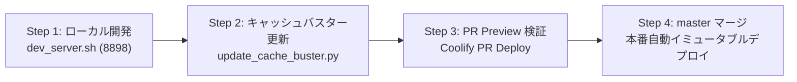

# Frontend Static Assets Workflow & Cache-Busting Standard

## 概要
フロントエンド静的ファイル（HTML / JavaScript / CSS / 画像等）の改修時において、ブラウザやプロキシ・CDNによるキャッシュ残留事故（Cache Bleeding / 古いJSの実行）および、コンテナ環境におけるバインドマウント競合（作業ブランチ差分の本番漏洩）を恒久的に防止するための開発運用標準。

---

## 1. 根本課題と原則

### ① キャッシュ事故の防止（Cache-Busting の徹底）
- ブラウザやプロキシは静的ファイルを強力にキャッシュするため、JS/CSSの修正が即座に反映されず、ユーザー環境で古いスクリプトが動き続けて予期せぬエラーや不整合を引き起こす。
- **原則**: HTML側で読み込む `<script src="...">` および `<link rel="stylesheet" href="...">` には、必ず更新日時やハッシュによるクエリパラメータ（例: `?v=YYYYMMDD_HHMM`）を付与し、修正時に必ず最新化する。

### ② 本番環境と開発環境の完全分離（イミュータブル化）
- 本番コンテナでホストの作業ディレクトリ（`src/web`）をバインドマウントすると、開発中の未コミット変更や作業ブランチの差分がリアルタイムに本番画面へ漏洩する。また、PR Preview Deploy とも競合する。
- **原則**:
  - **本番コンテナ（Coolify/Docker）**: 静的資産およびコードはコンテナイメージ内部に内包（COPY）し、バインドマウントは絶対にしない（イミュータブル運用）。
  - **ローカル開発環境**: ホスト上でローカルサーバーを起動し、ビルド待ち時間ゼロ秒で即時確認する。

---

## 2. 標準開発 4ステップ・ワークフロー



### Step 1: ローカル開発 ＆ 即時プレビュー（ビルド待ち 0秒）
- UI（HTML / JS / CSS）の改修時は、Dockerコンテナのビルドを待たず、ホスト上でローカル開発サーバーを起動する。
- **コマンド**:
  ```bash
  ./scripts/dev_server.sh
  # または
  PORT=8898 HOST=0.0.0.0 uv run python src/server.py
  ```
- **アクセス**: `http://<HOST_IP>:8898/`
- **開発時のブラウザ設定**:
  - DevTools（F12）の「Network」タブで **「Disable cache」** を有効にする。
  - ファイル保存後、ブラウザをリロード（`F5` または `Ctrl+R`）するだけで即時反映される。

### Step 2: キャッシュバスターの更新（自動化）
- 改修が完了しコミットを行う直前に、キャッシュバスター更新スクリプトを実行して `index.html` 内のクエリパラメータを最新化する。
- **コマンド**:
  ```bash
  uv run python scripts/update_cache_buster.py
  ```
  - 対象: `src/web/index.html` 内のすべての `<script src="*.js?v=...">` および `<link rel="stylesheet" href="*.css?v=...">`
  - フォーマット: `?v=YYYYMMDD_HHMM`（例: `?v=20260918_1625`）

### Step 3: Git コミット ＆ PR Preview による統合検証
- 修正した静的ファイルと、更新された `index.html` を一緒にコミット・プッシュして PR を作成（更新）する。
- Coolify の PR Preview（例: `http://1.danbooru.hannya.org`）上で、Dockerコンテナビルド後の実際の動作、プロキシ経由でのリバースプロキシ連携、表示崩れがないか最終検証する。

### Step 4: master マージ ＆ 本番リリース
- PR を `master` ブランチへマージする。
- Coolify により本番コンテナが自動的に最新コミットの Dockerfile でビルド・デプロイされる。
- キャッシュバスターが更新されているため、既存ユーザーのブラウザでも即座に最新の JS/CSS が強制読み込みされる。

---

## 3. コミット前チェックリスト

静的ファイルを変更した際は、コミット前に以下のチェックを必ずパスすること：
- [ ] `scripts/dev_server.sh` でローカル動作確認を行ったか？
- [ ] `uv run python scripts/update_cache_buster.py` を実行し、`index.html` のクエリパラメータを更新したか？
- [ ] `git diff src/web/index.html` で `?v=...` が意図通り更新されていることを確認したか？
- [ ] 本番コンテナに `src/web` のバインドマウントが残っていないか？
